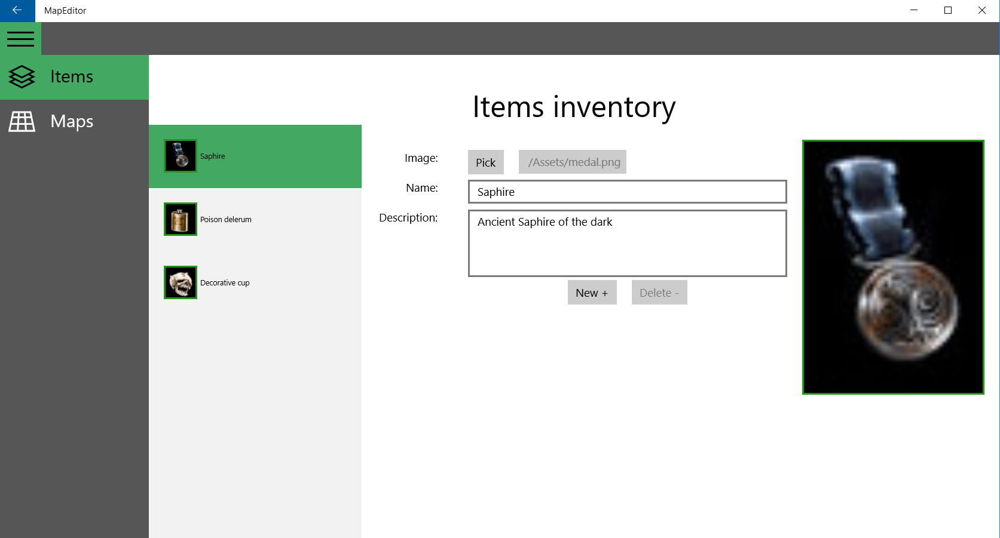
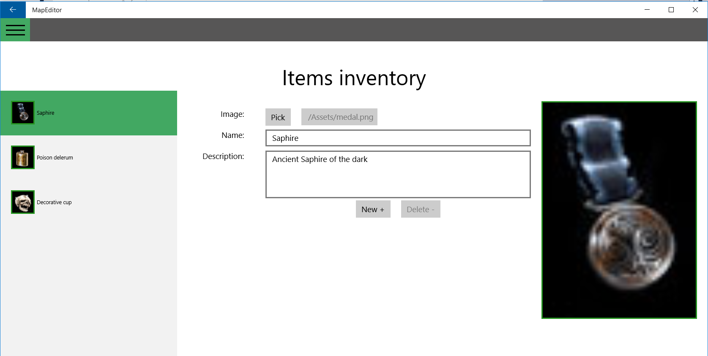
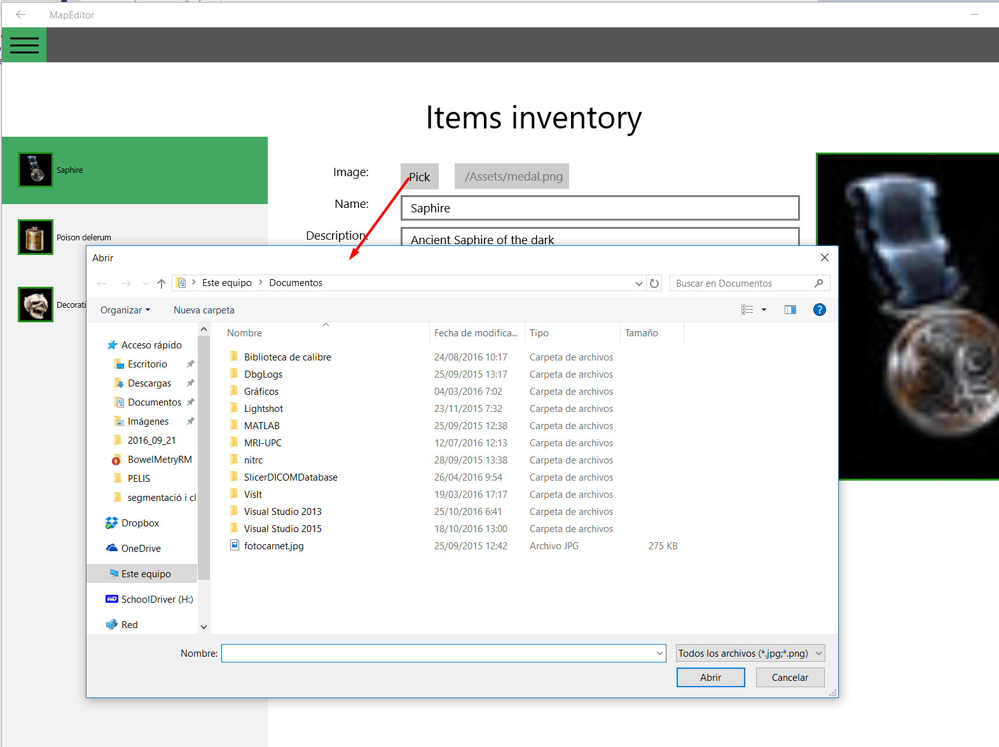
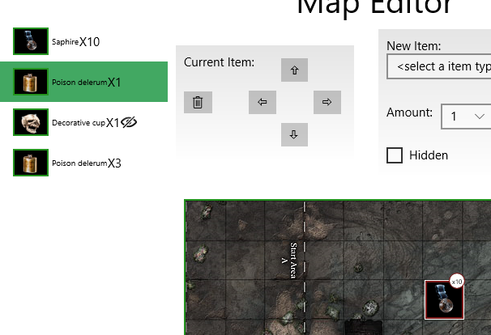
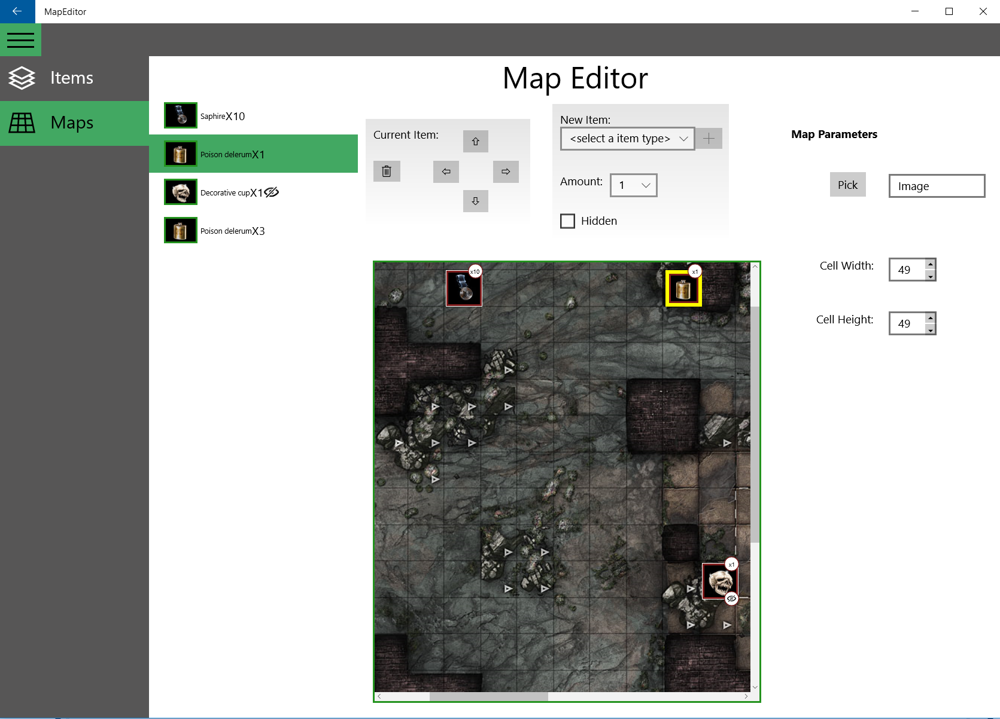

# Pràctica "Map Editor"

__OBJECTIU:__ Es desitja construir una aplicació per editar/mantenir els mapes d'un joc d'aventures en 2D. El programa ens ha de permetre dos grans funcionalitats:
 * Gestionar items que es poden col·locar en un mapa ( crear-los/modificar-los i esborrar-los ). Cada Item té un nom, una descripció i una fotografia.
 * Posicionar els ítems en el mapa. Cada ítem pot aparèixer MULTIPLES vegades al mapa, amb diferents valors de quantitat (amount) , posició i visibilitat.

 
## Seccions


### Menú
Per fer el menú, usarem un SplitView. Teniu un tutorial fantastic on explica, entre moltes altres coses, com muntar un menú semblant al que des demana.




L'SplitView contindrà un panell on estarà el menú, i com a contingut principal tindrà un Frame on anirem carregant les pàgines. 
Podeu trobar molts tutorials per muntar aquest tipus de menú que es solen anomenar [Hamburguer menu](https://maximelabelle.wordpress.com/2016/02/02/building-a-hamburger-menu-for-your-universal-app/)

### Pàgina Ítems
Podem donar d'alta, esborrar o modificar els camps d'un ítem. Vegeu captures anteriors per saber quin ha de ser l'aspecte de la pàgina.
Tots els camps són obligatoris. Quan el camp sigui erroni es deshabilitaran el boton de desar i es mostrarà el camp erroni amb un suau color vermell de fons.
El nom té un mínim de 4 lletres, mentre que la descripció en requereix 10 com a mínim. (eviteu desar els espais inicials o finals )

En qualsevol moment, es pot seleccionar una imatge, a partir d'un botó  que ens mostrarà un selector d'arxius.


_ATENCIÓ_ : no poderem esborrar ítems que estan en ús en el mapa. ( es mostrarà una finestra de diàleg d'error )

### Pàgina Edició de Mapa
Un ítem pot ser col·locat múltiples vegades en el mapa. És el que coneixerem com a 'MapItem'. Els MapItems estan associats a un tipus de ítem definit a la pàgina anterior, i tenen unes coordenades sobre la graella del mapa, una quantitat i un atribut booleà de visibilitat.
La pantalla ens mostra els ítems del mapa en una llista a l'esquerra i també situats sobre el mapa. 
Les funcionalitats esperades són:
 - capacitat d'afegir nous ítems.
Seleccionar els items. L'ítem seleccionat es mostrarà ressaltat en el mapa amb un requadre groc més gruixut.
Els ítems són seleccionables mitjançant la llista, o prement directament a sobre d'ells en el mapa.


 - Moure i esborrar l'ítem seleccionat. Sobre l'ítem seleccionat es poden fer operacions de desplaçament ( botons de cursor ) i es poden esborrar ( botó esborrar )

 - Finalment, l'edició del mapa permet seleccionar qualsevol imatge, així com definir la mida de la graella que volem utilitzar en pixels d'alçada i d'amplada.



## Recursos
Arxius proporcionats:
 * [Assets: Mapes i icones d'exemple](resources/resources.jar)
 * [Classes del model ](resources/model.zip)

 
## Codi proporcionat 


```c#
		/// Obrir un selector d'arxius, triar un arxiu i copiar-lo a la carpeta ApplicationData del
		/// programa. Crear una imatge en memòria a partir de l'arxiu.
        private async void btnFile1_Click(object sender, RoutedEventArgs e)
        {
                FileOpenPicker fp = new FileOpenPicker();
                fp.FileTypeFilter.Add(".jpg");
                fp.FileTypeFilter.Add(".png");

                StorageFile sf = await fp.PickSingleFileAsync();
                // Cerca la carpeta de dades de l'aplicació, dins de ApplicationData
                var folder = ApplicationData.Current.LocalFolder;
                // Dins de la carpeta de dades, creem una nova carpeta "icons"
                var iconsFolder = await folder.CreateFolderAsync("icons", CreationCollisionOption.OpenIfExists);
                // Creem un nom usant la data i hora, de forma que no poguem repetir noms.
                string name = (DateTime.Now).ToString("yyyyMMddhhmmss") + "_" + sf.Name;
                // Copiar l'arxiu triat a la carpeta indicada, usant el nom que hem muntat
                StorageFile copiedFile = await sf.CopyAsync(iconsFolder, name);
                // Crear una imatge en memòria (BitmapImage) a partir de l'arxiu copiat a ApplicationData
                BitmapImage tmpBitmap = new BitmapImage(new Uri(copiedFile.Path));
			// ..... YOUR CODE HERE ...........
        }
		
		

        /// <summary>
        /// Read the storage file in text mode, returning it as string.
        /// Carriage return and line feed are supressed, and replaced by spaces.
        /// </summary>
        /// <param name="sf"></param>
        /// <returns></returns>
        private async Task<string> readTextFile(StorageFile sf)
        {
            StringWriter sw = new StringWriter();
            IRandomAccessStream stream = await sf.OpenAsync(FileAccessMode.Read);
            using (StreamReader streamReader = new StreamReader(stream.AsStream()))
            {
                string line;
                while ((line = streamReader.ReadLine()) != null)
                {
                    //txt += line + Environment.NewLine;
                    sw.Write(line + " ");
                }

                return sw.ToString();
            }
        }
		
```		