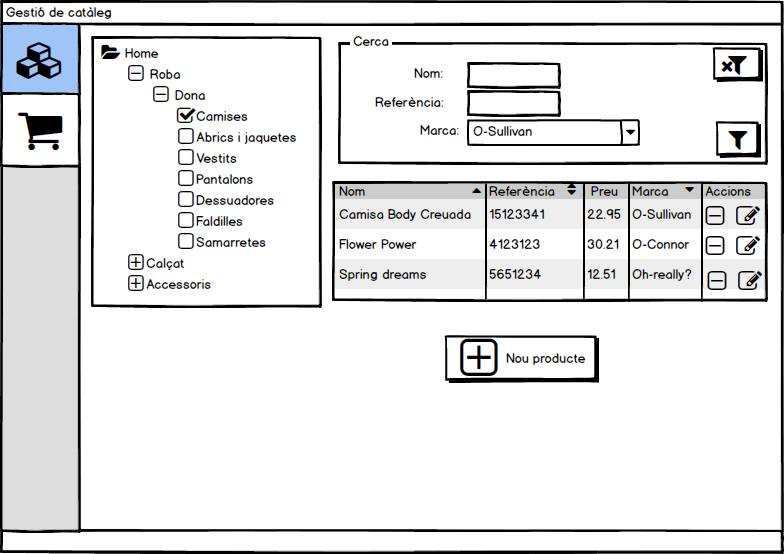
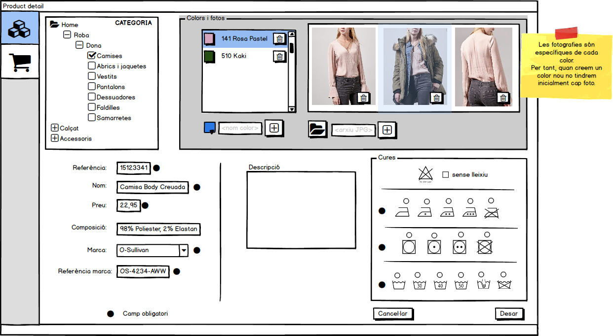

# Pràctica d'Accés a Dades

## Introducció

El nostre client desitja construir una aplicació per gestionar el catàleg de productes d'una botiga de roba, calçat i complements.
L'analista, després d'una reunió amb el client, ha preparat una maqueta de les pantalles que cal crear inicialment. Sobre aquestes pantalles el client
valorarà si desitja continuar amb el projecte.

Per accelerar el procés de construcció de l'aplicació, es construirà una maqueta que funcionarà amb una simple base de dades SQLite. Més endavant caldria accedir a un servidor extern, però això queda fora de l'àmbit d'aquesta pràctica.

Per facilitar-nos la feina, l'analista també ens proporciona  un esquema relacional de la base de dades. Amb ell us serà fàcil escriure un script SQL de creació de BD adaptat a la sintaxi SQLite. També caldrà que confeccioneu un script d'insercions per crear un joc de dades amb varies categories i productes. Això agilitzarà les vostres proves.

## Pantalles
Caldrà construir tres pantalles, dues es corresponen al Backoffice, que seria la gestió de catàleg que fa el propietari de la botiga, i l'altre al front-office, que equivaldria a la App que veuria el client.

### Backoffice > Gestió del catàleg


### Backoffice > Edició i alta de productes


### Frontoffice > Catàleg de productes


## Codi proporcionat 

Es proporciona el codi que permet obrir un selector d'arxius, llegir-lo i desar-lo
en un string.

```c#
		/// How to program a File Picker, and read the selected file
		/// into a string.
        private async void btnFile1_Click(object sender, RoutedEventArgs e)
        {
            FileOpenPicker fp = new FileOpenPicker();
            fp.FileTypeFilter.Add(".txt");
            fp.FileTypeFilter.Add(".rtf");

            StorageFile sf = await fp.PickSingleFileAsync();
            string textReadFromFile = await readTextFile(sf);
            
			// ..... YOUR CODE HERE ...........
        }
		
		

        /// <summary>
        /// Read the storage file in text mode, returning it as string.
        /// Carriage return and line feed are supressed, and replaced by spaces.
        /// </summary>
        /// <param name="sf"></param>
        /// <returns></returns>
        private async Task<string> readTextFile(StorageFile sf)
        {
            StringWriter sw = new StringWriter();
            IRandomAccessStream stream = await sf.OpenAsync(FileAccessMode.Read);
            using (StreamReader streamReader = new StreamReader(stream.AsStream()))
            {
                string line;
                while ((line = streamReader.ReadLine()) != null)
                {
                    //txt += line + Environment.NewLine;
                    sw.Write(line + " ");
                }

                return sw.ToString();
            }
        }
		
```		